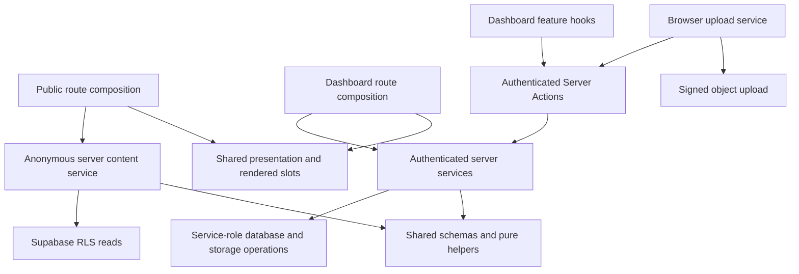

# Project Review — September 13, 2026

The architecture is sound enough to improve incrementally. The highest-value work
is to make editor transactions consistent, remove unnecessary production code,
and tighten the data passed across rendering boundaries. A broad directory
reorganization or a generic CRUD framework would add churn without addressing the
observed problems.

This review covers architecture, component responsibilities, consistency, reuse,
state/data flow, types/styles/accessibility, and measured performance. Decisions
requiring the owner's preference are collected in the final section.

## Scope and evidence

- Reviewed commit: `82a1eac4516888c8be47bcd9a3e1d8394e57eff7`; the initial working
  tree was clean. Application behavior was reviewed without saving, deleting, or
  uploading business data.
- Automated source inventory: 213 TypeScript/TSX files, 13,496 lines, 493 resolved
  local import/re-export edges, and 38 explicit client entry files. Counts include
  tests and generated TypeScript; they are inventory, not complexity scores.
- Used the React Best Practices, Next.js, Functional TypeScript, Rsdoctor Analysis,
  and agent-browser skills. Read the installed Next.js 16.3.3 documentation for
  caching, rendering boundaries, bundling, and lazy loading.
- `bun run check` passed. `bun run test` passed: 22 tests, five suites, 101 assertions.
  The installed runner reports Bun `1.4.0-canary.1`; package/CI pin `1.3.14`.
- Reused the existing production build from **20:57:57 Asia/Shanghai**. Its timestamp
  is newer than the inspected source/config files. Started an isolated production
  process with `bun --env-file=.env.development run start --port 3107` and checked
  it in Chromium. This review did **not** perform a fresh build or measure build time.
- An existing process on port 3001 referenced stale chunks; its measurements were
  discarded. The measurements below use the isolated process and current artifacts.

The [sanitized evidence](./reviews/2026-09-13/evidence.json) records exact byte
counts, timings, graph scope, and browser outcomes. It contains no credentials or
document bodies. Findings distinguish **confirmed behavior**, **measured cost**,
and **recommendations requiring further measurement**.

## Findings and proposed fixes

P1 means a user can lose work or lose track of an in-flight operation. P2 means a
confirmed functional defect or a worthwhile operational/performance fix. P3 means
incremental maintainability work or a scaling improvement below current priorities.

### R1 · P1 · Escape bypasses the editor's save/upload dismissal guard

**Confirmed in the browser.** The editor disables its Close button during saving
and uploading, but the modal's document-level Escape handler closes the active
modal unconditionally.

Evidence: [editor Close button](<../src/app/(admin)/dashboard/_components/features/content/content-editor.component.tsx#L75>)
and [modal Escape handler](../src/components/ui/modal.hook.ts#L83). A save POST was
held by a temporary browser fetch interceptor **before transmission**. While the
request was pending, Close was disabled and the document was readonly. Pressing
Escape removed the editor after the exit animation. No save reached the server.

If a real save subsequently fails, the form and its error/retry surface are gone.
If it succeeds after another editor opens, the original `onSaved` callback's
unqualified `close()` can close the newer top modal. The latter outcome follows
from the callback ownership in
[useContentList](<../src/app/(admin)/dashboard/_components/features/content/content-list.hook.tsx#L26>);
it was not separately reproduced.

**Fix:** give each modal an updatable dismissal policy owned by its editor. Route
Escape, backdrop dismissal, Close, and relevant navigation through that policy.
Close a successfully saved editor by its captured modal ID. Saving/uploading
must have a consistent rule across all dismissal paths; idle dirty-draft handling
is a separate product decision.

**Acceptance:** with a delayed save or upload, Escape cannot silently destroy the
editor. A failed save retains its draft. An older completion cannot close a newer
modal. Native image-viewer Escape continues to close only the viewer.

### R2 · P2 · Metadata remains editable while the submitted snapshot is saving

**Confirmed enabled state; lost-update consequence verified from the code.**
[Save captures `parsed.data`](<../src/app/(admin)/dashboard/_components/features/content/content-editor.hook.ts#L84>)
before awaiting the action. The BlockNote body becomes readonly, but
[publish time, visibility, and event color](<../src/app/(admin)/dashboard/_components/features/content/content-editor.component.tsx#L35>)
remain interactive. In the delayed-save browser scenario, both visibility buttons
were still enabled.

A change made to those fields after clicking Save is absent from the submitted
snapshot, and success closes the editor without preserving it.

**Fix:** derive one saving state and apply it to every editable field, or explicitly
support edits during save with draft revisions and a subsequent-save flow. For
the current manual-save CMS, disabling the full form is the smaller change.

**Acceptance:** publication metadata and document content obey the same pending
rule, and the displayed success corresponds to the saved values.

### R3 · P2 · Agentation ships in the production administration bundle

**Measured and observed in the browser.**
[The admin root](<../src/app/(admin)/layout.tsx#L3>) statically imports Agentation and
conditionally renders it only in development. The production client-reference
manifest nevertheless maps Agentation to module `31012` in
`3k0z96ewq-iws.js`, which the authenticated dashboard requested.

The Agentation module itself contains **423,011 raw bytes / 93,046 independently
gzipped bytes**. Its containing chunk is **427,943 raw / 95,083 gzip bytes**;
the browser received 94,956 encoded body bytes. The same chunk is in the `/auth`
and all dashboard first-load groups. This is concrete production download cost,
even though the toolbar is not rendered.

**Fix:** isolate the development integration behind a conditional loading boundary
that disappears from the production client graph. Verify the emitted graph and
actual requests; moving the JSX condition alone is insufficient. After that,
consider moving dashboard-only modal/viewer providers below the auth route if the
remaining measured auth cost warrants it.

**Acceptance:** production auth/dashboard loads have no Agentation module/request;
the development toolbar still works. Per-module gzip identifies the opportunity,
not a guaranteed byte-for-byte saving after a new build.

### R4 · P2 · Viewing Files eagerly loads the upload implementation

**Measured cost.** [useFiles](<../src/app/(admin)/dashboard/_components/features/files/files.hook.ts#L5>)
statically imports the upload service, which imports image compression, the
Supabase browser client, and runtime upload validation. Opening Files without
selecting a file requests `2gyjtjxi154qd.js` (**292,077 raw / 82,848 gzip bytes**),
containing Supabase and browser-image-compression code. The validation chunk
`3rrjuck24susc.js` adds **374,751 raw / 86,119 gzip bytes** and is also fetched.

Files has **163.5 KiB more estimated first-load gzip** than the content dashboard
routes. This difference includes route-specific code and is not a promise that
all of it is removable.

**Fix:** import the upload service when a batch starts, with an immediate pending
state; optionally preload it on upload intent. Load compression only for image
types that use it. Preserve signed browser uploads, server authorization, and all
validation. This follows Next.js's supported
[on-demand library loading](https://nextjs.org/docs/app/guides/lazy-loading).

**Acceptance:** listing/sorting/deleting files does not download the compression
implementation; first upload, image compression failure, ordinary attachments,
and retry still work. Do not replace Supabase or validation libraries merely to
chase a guessed bundle saving.

### R5 · P2 · An empty Files page incorrectly reports an empty bucket

**Confirmed by readonly RPC and browser checks.**
[The SQL RPC](../supabase/schemas/03_storage.sql#L18) attaches windowed totals to
each returned row. [The service](../src/lib/server/files/files.service.ts#L28)
defaults totals to zero when pagination returns no rows.

The local bucket contained **two files totaling 932,790 bytes**. Opening
`/dashboard/files?page=100000` showed **0 files, 0.0 KB total, Page 100001**. The same
problem can occur naturally when the last item on a nonzero page is deleted or
the bucket shrinks while a page URL remains open.

**Fix:** return totals independently of the page's rows, or obtain a separate
authorized aggregate and normalize an out-of-range page. Update the schema source,
service, generated types, and documentation together using the repository's
[database workflow](../README.md#database).

**Acceptance:** empty pages retain correct bucket totals and offer sensible recovery;
deleting the last row on a later page does not make the bucket appear empty.

### R6 · P2 · Dashboard feeds serialize raw documents beside rendered documents

**Confirmed in the response payload.**
[listContent](../src/lib/server/content/content.service.ts#L29) attaches `document`
to Thought/Event summaries. [ContentPageData](<../src/app/(admin)/dashboard/_components/features/content/content-page.component.tsx#L28>)
renders those documents and also spreads the original `items` into the client
`ContentList`.

The local Thoughts response contained nine raw `document` props, and Events
contained eight, alongside their rendered HTML. Their complete HTML/Flight
responses were 93,416 and 92,186 bytes respectively. Editing already loads a
record through `loadContent`, so list interaction does not require these raw
document props. Those response sizes are baselines, not estimates of removable
bytes.

**Fix:** retain raw documents inside the server composition step and pass a lean
list item DTO plus rendered slots to the client. Separate persisted records,
rendering inputs, and client list summaries in the type model.

**Acceptance:** Thought/Event initial responses contain rendered content but no raw
BlockNote `document` property in list item props. Opening the editor still loads
the complete record. Keep the shared feeds usable as Server Components publicly.

### R7 · P2 · Public data fallbacks discard the cause of failures

**Confirmed in source; no outage was induced.**
[PublicContentData](<../src/app/(site)/_components/layout/public-content.component.tsx#L23>),
[PostsIndex](<../src/app/(site)/posts/_components/posts-index.component.tsx#L12>),
and [DisplayStats](<../src/app/(site)/_components/display/display-stats.component.tsx#L10>)
turn all query/validation exceptions into `null` without reporting the cause.
The local fallback is useful, but an unavailable database and an invalid stored
document become indistinguishable operationally.

**Fix:** keep the local unavailable UI and record a bounded server diagnostic with
the operation and content kind, excluding keys and document bodies. Distinguish
empty results, unavailable data, and invalid records in the domain result where
the recovery differs. Provide a consistent retry affordance when practical.

**Acceptance:** a deliberately failed read preserves the surrounding page and
produces an actionable diagnostic. Empty content remains a normal state.

### R8 · P3 · Archive queries read every document to produce list metadata

**Measured current data volume; growth risk, not a current latency incident.**
[listPublicContent](../src/lib/server/content/public-content.service.ts#L19)
selects all columns in sequential 250-row batches, requesting an exact count each
time. It parses every document and computes its character count on every request.

The current public Posts query returned **78,213 JSON bytes for nine posts**;
**74,571 bytes** were document JSON. Gzip compressed the complete response to
4,373 bytes because the demo content is repetitive. Posts only needs titles,
dates, IDs, and the aggregate character count for its archive UI.

**Fix direction:** if content volume grows, add a purpose-specific archive
projection and maintain character counts at the write/database boundary, including
backfill and all writers. Thoughts/Events still need content for their feeds;
their all-record rendering policy needs its own decision. Avoid repeatedly
requesting exact counts if one count or a suitable paging contract suffices.

**Acceptance:** character counts remain correct after edits, hide/show, and deletes;
public visibility checks remain fresh. Do not introduce shared caching of database
records or remove the exporter's serialization as a shortcut.

## 1. Architecture and dependency direction

The current flow is coherent:

The AST graph found **zero strongly connected components with multiple modules**,
both with and without type-only edges. It found no shared-domain imports of UI or
runtime services, no shared/script imports of routes, and no public-to-admin
imports. Client traversal stopped at `use server` RPC boundaries and found no
reachable server service implementation. The single `#dictionary` conditional
import was checked separately. This is source-graph evidence, not a claim that
third-party packages are cycle-free or a substitute for a fresh production build.

Preserve these boundaries:

- Admin page reads and Server Actions authenticate independently; services also
  check the session. A layout-only authorization shortcut would weaken this.
- Public queries use an anonymous client and explicit visibility filtering. The
  service-role factory remains server-only; browser upload credentials are scoped.
- Domain transformations, document schemas, and audio parsing remain neutral;
  browser compression and spectrum fetches have browser owners.
- Public and admin roots share tokens and theme behavior while retaining separate
  provider trees. Sharing the editor or admin providers with the public shell would
  undo useful separation.

One small dependency inversion is worth cleaning up when touching the service:
`content.service.ts` imports `InputError` from the action orchestration module.
An expected content-domain error should have a neutral/domain owner that both
the service and action adapter can consume. This is a maintainability concern,
not a detected cycle or authorization defect.

## 2. Component responsibilities

Component size is generally controlled. The largest owned application component
is the 315-line System guide, largely explicit samples. The 343-line token file is
the required single token owner. Neither should be split just to lower line counts.

The dashboard's `ContentPage` → `ContentList` → presentation/action slots and
`ContentEditor` → editor hook → BlockNote adapter are sensible compositions.
`ContentEditor` has four explicit props. Guestbook form/list/state and audio
session/playback/spectrum already have meaningful separate owners.

Two changes would improve responsibility boundaries when their behavior changes:

- `useArticleToc` combines reading-position observation, disclosure/focus/pointer
  behavior, and motion coordination. A private reading-position hook can own the
  scroll/resize subscription independently of disclosure behavior. Retain the
  existing motion hook and browser regressions.
- `useDeskNavigation` owns intro choreography, route transitions, and DOM
  focus/scroll locking. Separate the intro policy from navigation while addressing
  the measured delay below. Preserve its cancellation sequence and recovery timer.

The audio session hook exposes many low-level getters and setters to playback.
Prefer operations such as restore/select/capture at that boundary when extending
audio import or recovery. Its refs mirror an external audio element and persisted
session; their existence alone is not redundant-state evidence.

## 3. Consistency of routes, forms, and states

Posts, Thoughts, and Events share dashboard orchestration and controls while using
different presentation where the content warrants it. Public Thoughts and Events
share a page composition; Posts owns its year-grouped archive. Explicit local
Suspense boundaries cover dashboard reads. This is consistent reuse without
forcing unlike pages into the same template.

`useActionState` for the token form, an editor-specific async hook for BlockNote,
and a synchronous local guestbook form are appropriate to their different data
flows. A form-library migration would not fix R1/R2.

Smaller cleanup opportunities:

- README's Dashboard section says Files has no search field, while its Files
  section advertises name search. The SQL/service supports search, but the route
  and UI do not expose it. Document the current UI accurately; restoring search
  is a product choice.
- Two `formatSize` implementations disagree on zero, sub-KiB values, and precision.
  The [shared helper](../src/lib/shared/utils/file-size.helper.ts) has no current
  consumers; the [feature helper](<../src/app/(admin)/dashboard/_components/features/files/file-size.helper.ts>)
  serves Files. Remove the unused implementation or consolidate only when reuse is
  real. Do not create a formatting framework.
- Shared labels and error defaults are often literal strings even though the
  dictionary already owns Save/Delete/Loading and other common copy. Consolidate
  repeated UI defaults in that owner as affected files change, preserving English
  defaults and original-language business content.
- New naming and placement largely match AGENTS.md. Framework files and generated
  icon/database files should retain their established names and generation workflow.

## 4. Reuse and abstraction

The feed components' `body`, `actions`, and `visibility` slots are a useful shared
presentation contract. Their optional action slots do not import admin features.
Button/IconButton/Input and typed StyleX overrides are also appropriately small.
Visual variants on Image and SegmentedToggle are presentation concerns, not
evidence of excessive business branching.

R6 is the main abstraction correction: `ContentSummary` currently serves both
server rendering and client list interaction. Split those contracts by consumer
needs. The shared feeds also know the dashboard's 30-row paging convention through
`page * 30`; a caller-supplied starting ordinal would remove that policy if paging
changes. Until then, this is minor coupling, not a reason to duplicate feeds.

Keep the native-dialog image viewer separate from the dashboard-anchored editor
modal. Their top-layer, geometry, and dismissal requirements differ. Share small
focus/close policies only where the contracts actually match.

## 5. State, effects, caching, and error flow

The inventory found 36 effect/layout-effect calls across 17 files. Most synchronize
external systems: media queries, DOM focus, resize/scroll observers, audio, or
network cancellation. They include cleanup. The content loader ignores stale
responses; spectrum loading aborts on change/unmount; scroll observers schedule
through animation frames; playback tracks async request identity. Those are useful
patterns to retain. React's guidance distinguishes external synchronization from
derived state and event work; an effect count alone is not a defect.
[React effect guidance](https://react.dev/learn/you-might-not-need-an-effect).

The important state defect is incomplete coordination during saving (R1/R2).
For uploads, a discriminated state with an error only on failed items would improve
the current `status` plus optional `error` type. Keep sequential uploads unless
measurements justify bounded concurrency; it currently limits simultaneous image
compression and memory usage.

Caching is deliberately scoped and internally consistent:

- Public database reads run after `connection()` and use `no-store`.
- `readPublicPost` uses request-local React `cache()` for metadata/body reuse.
- `use cache` / `cacheLife('hours')` owns document HTML and article preparation,
  keyed by content. Authorization and visibility checks precede reuse.
- Content actions revalidate dashboard, matching public lists, article details,
  and applicable homepage counts. There are no active content tags to repair.
- BlockNote exports are serialized because the exporter changes JSDOM globals.
  `Promise.all` at a caller does not make these exports independently parallel;
  removing serialization would violate the renderer's safety contract.

Keep cache behavior aligned with
[Architecture](./ARCHITECTURE.md#public-content-and-caching). Any future summary
projection or caching change must update its writers, consumers, and invalidation
paths as one change. R7 addresses the current difference between resilient UI
fallbacks and insufficient operational diagnostics.

## 6. Types, styles, accessibility, and regression protection

Strict TypeScript, inferred Zod inputs/results, discriminated action results,
server-only modules, and generated Supabase types provide useful boundaries.
One improvement is to distinguish editable draft input from transformed persisted
output: `ContentInput` currently includes the derived title from the schema's
output. R6's smaller list DTO is a more immediate type-boundary improvement than
adding more generic types. `Readonly` wrappers remain shallow where arrays are
mutable; tighten exported collection types when changing their owners.

Rendered theme/material colors are centralized in `tokens.stylex.ts`. A scan of
owned style/TSX files found no extra literal hex/RGB/HSL colors outside generated
brand icons. Event color values are business data and appropriately remain dynamic.
CSS is confined to root resets and the BlockNote adapter; component geometry
remaining local follows the design guide.

The browser review checked meaningful rendering, editor loading, keyboard Escape,
and a 390 × 844 article with 80 TOC entries. The TOC opened, selected its last entry,
updated the hash, closed, and showed no horizontal document overflow. The reduced
motion path was used for that TOC scenario. Desktop dark-home and mobile light-TOC
screenshots were visually inspected. No application page errors were observed in
the isolated browser session. This is targeted acceptance evidence, not a complete
accessibility audit or a claim of physical Safari compatibility.

The existing five suites test important boundaries rather than component
implementation. Retain them. Prioritize these regression scenarios with fixes:

1. Delayed/failed save, metadata changes during save, Escape/backdrop/navigation,
   and returning focus after successful close (R1/R2).
2. Expired session during editing and upload signing; retained content after
   reauthentication. This review did not execute the full expired-session flow.
3. Empty/out-of-range Files pages and deleting the last row on a later page (R5).
4. Upload loading after code splitting, mixed file types, compression failure,
   failed-batch retry, and signing failures (R4).
5. Repeated TOC selection, nested wheel/touch scrolling, hash history, keyboard
   exit, reduced motion, and native image preview across both roots.

CI currently checks formatting, lint, types, and tests, but does not build. Add a
production build/smoke step for runtime boundaries and bundle regressions, using
test configuration. `reactStrictMode: false` and globally disabled React
purity/ref/set-state-in-effect checks reduce development feedback; investigate
the original compatibility reason and narrow exceptions before enabling them.
Do not assume compiler-enabled code has been profiled or that every manual memo
would help. Physical iOS/Safari remains tracked in [TODO](./TODO.md).

## 7. Performance: measured priorities

### Production JavaScript baseline

These numbers sum the unique chunk paths listed **within each route** in
`.next/diagnostics/route-bundle-stats.json`; gzip is computed independently per file
with Bun's Node-compatible `gzipSync`. They exclude HTML/Flight, CSS, media, and
later editor chunks. They are not unique transfer totals across a browsing session:
shared chunks can be cached, and prefetches can add network traffic.

| Route group                               | Raw JS, KiB | Estimated gzip, KiB |
| ----------------------------------------- | ----------: | ------------------: |
| Files                                     |     1,776.3 |               484.4 |
| Dashboard Posts / Thoughts / Events, each |     1,129.6 |               320.9 |
| Homepage                                  |     1,105.0 |               322.9 |
| Authentication                            |     1,094.2 |               307.2 |
| Article detail                            |       671.7 |               215.0 |
| Public Posts / Thoughts / Events, each    |       658.1 |               209.3 |

**First lever: R3**, because approximately 90.9 KiB of independently gzipped
development-only module code has no production purpose. **Second lever: R4**,
because Files need not initialize upload dependencies just to list objects.

On the homepage, the validation-containing chunk accounts for **84.1 KiB**, about
**26%** of estimated initial gzip. Investigate how hidden display programs and
preferences pull validation into the initial graph before choosing a change.
Candidate approaches are loading a program when selected and using a narrower
supported validator entry point. No replacement saving or locale/tree-shaking
diagnosis is asserted without a controlled build comparison.

### Interaction delay exceeds local data delay

Three normal-motion direct visits to `/posts` released the content's `inert` state
at **2,241 / 2,174 / 2,175 ms** from navigation start. Their TTFBs were **6 / 2 / 3 ms**
and DOMContentLoaded was **65 / 37 / 34 ms**. This measures when the shell permits
interaction, not LCP or INP.

[The navigation hook](<../src/app/(site)/_components/layout/desk-navigation.hook.ts#L42>)
waits 1,400 ms before a 750 ms curtain animation on normal direct visits, including
reading routes. Internal navigation also waits through a 500 ms cover animation
before calling `router.push`. This is intentional choreography with a material
performance tradeoff. Resolve the final-section intro decision before spending
time shaving milliseconds from queries or helper functions.

### Server and media costs

Four serial local HTTP reads per public route produced warm full-response medians
of **8.2 ms** for Home, **14.1 ms** for Posts, **11.0 ms** for Thoughts, and **10.2 ms**
for Events, using the final three samples. The first measured Thoughts response
took **81.5 ms**. These are local application-plus-Supabase observations on small
data, not deployment p95, a clean cold-cache experiment, or field Core Web Vitals.
They place R8 below confirmed client loading and interaction costs today.

Public assets total about **4.27 MiB**, led by `miku.mp3` (3,571,042 bytes),
`quiet-morning.wav` (705,644), and the Miku spectrum (160,672). The browser's idle
homepage did not request the Miku MP3. The selected audio uses metadata preload,
and its spectrum loads immediately. Asset inventory must not be counted as
first-load transfer. Compressing or deferring audio can be evaluated for playback
cost, but replacing it is not the first initial-navigation optimization.

### Analysis limits and follow-up categories

No `rsdoctor-data.json` or Rsdoctor plugin was present. Following the Rsdoctor
skill's missing-data gate, no Rsdoctor command, installation, or bundler change
was performed. This report therefore makes no E1001/E1002 duplicate-package claims
and no package-wide tree-shaking score. It uses the existing Turbopack production
artifacts, client-reference mapping, emitted module sizes, and browser requests.
Next.js documents its native Turbopack analyzer for deeper
[bundle attribution](https://nextjs.org/docs/app/guides/package-bundling).

Useful next categories, in order: production import retention; upload/program
loading boundaries; public interaction timing; archive query projections and
cold-render queue growth; then React commit/scroll costs if a trace shows jank.
No React Profiler, CPU-throttled trace, field LCP/INP/CLS, or cold-build timing was
collected. Speed Insights currently mounts only in the admin root, so it does not
provide public-page field evidence through the present integration.

## Suggested implementation sequence

1. Fix R1/R2 together around one editor transaction/dismissal contract; verify
   failure retention and modal identity in the browser.
2. Fix R3/R4, rebuild once for the final change, and compare route chunks plus
   real requests. Keep development integration and signed uploads working.
3. Fix R5 with the schema/service/types coordinated; remove raw list documents
   for R6 and add bounded failure diagnostics for R7.
4. Apply the owner's intro and growth choices. Do R8 when projected content volume
   justifies it. Make naming, copy, helper, and hook cleanups while touching their
   owners rather than opening a separate project-wide refactor.

Actionable follow-up is linked from [TODO](./TODO.md#review-follow-up).

## Decisions for the owner

1. **Where should the full intro play?** Recommendation: keep it on the homepage
   once per tab/session and allow direct reading routes to become interactive
   immediately. Alternatives are retaining the current approximately 2.2-second
   lock on every direct visit, or shortening it globally. Also decide whether
   route loading may start during the cover animation.
2. **How should an idle editor with unsaved changes close?** Recommendation:
   confirm discard when dirty and preserve the existing draft on save failure.
   Busy save/upload dismissal should be consistently guarded regardless of this
   choice. Automatic local draft recovery would be a larger, separate feature.
3. **What content volume should public feeds support over the next year?**
   Recommendation: keep the full Posts archive with a lightweight projection;
   set a practical Thoughts/Events loading policy if hundreds or thousands of
   documents are expected. Pagination/load-more would change the current
   documented all-record public feed contract.
4. **Should Files expose name search?** Recommendation: retain the current simple
   UI unless search is needed, and correct the README claim. The authorized RPC
   already supports search if a UI is desired.
5. **Should public performance become a release gate?** Recommendation: collect
   public LCP/INP/CLS, compare bundle baselines after optimization, and add a CI
   production smoke check. Choose the analytics destination and acceptable
   navigation/byte budgets before treating those thresholds as requirements.
6. **Should the next performance pass trace more package internals?**
   Recommendation: use the native Turbopack analyzer after R3/R4 and continue only
   for material remaining costs, particularly homepage validation. Stop at the
   current attribution if the resulting budgets are acceptable. Rsdoctor-specific
   duplicate/reference-chain work needs a compatible generated dataset; changing
   the project's bundler solely for this review is unnecessary.
