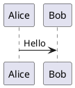

# Personal Site

A personal site and lightweight CMS built with Next.js 16, React 19, Supabase,
Tailwind CSS 4, and Bun. It publishes posts, thoughts, and events, with a dashboard
for content, tags, images, site configuration, and accounts.

The interface is English; content keeps its original language. Routes have no
language prefix.

## Getting Started

Requires Node.js 20.9+, Bun, and a running Docker-compatible runtime for local
Supabase. To use a remote Supabase project, skip local setup and copy
`.env.example` to `.env.development` with your project's values.

```bash
git clone https://github.com/muyu258/personal-site.git
cd personal-site
bun install
bun run supabase:setup
```

Setup writes local Supabase credentials to `.env.development`, preserving other
values. Set `WEBHOOK_SECRET` in that file, then start the app:

```bash
bun run dev
```

Open [the site](http://localhost:3000) or [sign in](http://localhost:3000/auth)
with email/password. Sign-up is available on the auth page. To grant an existing
user admin access, run `bun run menu dev` and choose `Promote user to admin`.

Local tools: [Supabase Studio](http://localhost:54323) and
[email inbox](http://localhost:54324).

### Environment Variables

- `NEXT_PUBLIC_SUPABASE_URL`: Supabase API URL.
- `NEXT_PUBLIC_SUPABASE_ANON_KEY`: Public anonymous key.
- `SUPABASE_SERVICE_ROLE_KEY`: Server-only key for privileged operations.
- `WEBHOOK_SECRET`: Private secret used by content webhooks.
- `NEXT_PUBLIC_APP_TIMEZONE`: Optional application timezone.

Keep environment files out of Git. Restart the dev server after changing them.

## Development

- Develop: `bun run dev`
- Build / serve production: `NODE_ENV=production bun run build` /
  `NODE_ENV=production bun run start`
- Check formatting / lint: `bun run fmt` / `bun run lint`
- Fix formatting / lint: `bun run fmt:fix` / `bun run lint:fix`
- Check types / test: `bun run typecheck` / `bun run test`
- Check formatting, lint, and types: `bun run check`
- Regenerate icons from `public/svg-icons`: `bun run gen:icons`
- Maintenance menu: `bun run menu dev` / `bun run menu prod`

The maintenance menu rebinds webhooks or promotes users to admin. It loads
`.env.development` for `dev` and `.env.production` for `prod`.

### Verification

Apply formatting and lint fixes to affected files, review the diff, then run
the relevant checks:

- Markdown-only changes: `bun run fmt -- <files>`.
- Source changes: `bun run check` and relevant tests with `bun run test`.
- Routing, caching, or server/client integration: also run `bun run build`.
- UI changes: verify affected flows in the app, including roles, cache updates,
  and light/dark or mobile/desktop layouts as applicable. There is no browser
  test suite.

GitHub Actions runs formatting, lint, types, and tests on branch pushes; it does
not build the app. Husky's pre-commit hook runs `bun run check` on the whole
working tree, including unstaged changes, without modifying or staging files.
`bun install` installs the hooks; `bun run prepare` reinstalls them.

## Database

Schema sources live in `supabase/schemas`; local fixtures live in
`supabase/seed.sql`. The CLI loads both through its seed configuration.
This repository does not use Supabase migration history.

After changing the schema, rebuild the local database and regenerate types:

```bash
bunx supabase db reset --local
bun run supabase:types
```

Reset deletes local data; do not reset a database containing data you need to keep.
Use an isolated Supabase workdir with a distinct project ID and unused ports
for schema experiments.
`--no-seed` skips both project schemas and fixtures; it does not create an empty
copy of the application tables.

- Start services and update local env: `bun run supabase:setup`
- Start / stop services, preserving data: `bunx supabase start` /
  `bunx supabase stop`
- Inspect local URLs and keys: `bunx supabase status`
- Refresh local env from running services: `bun run supabase:env`

The seed creates the public `images` storage bucket. Uploads and deletions
require admin access.

## Site Configuration

Use **Dashboard → Config** to edit About Me, recent plans, playlists, OAuth
provider availability, and dictionary overrides.

### Dictionary

The dictionary controls metadata and shared interface copy. In its editor,
**Defaults** lists available fields, **Overrides** accepts partial JSON, and
**Effective** previews the merged result:

```json
{
  "meta": { "siteTitle": "My personal site" },
  "home": { "hero": "Welcome", "bio": "Notes from my corner of the web." }
}
```

Missing fields use the defaults; arrays such as `home.typing` are replaced
entirely. Remove a field to restore its default, or use **Delete** to clear all
overrides. Keys and types are validated; dynamic messages must use supported
ICU syntax and placeholders. Rich-text tags are rendered explicitly, never as
raw HTML.

Saving updates metadata and copy without redeploying. Refresh other open tabs
to see the changes. See [Architecture](./DOCS/ARCHITECTURE.md#configuration) for
storage and cache behavior.

## Markdown Support

Content supports GFM, syntax highlighting, heading anchors, image previews, and
custom directives:

```md
:ref[Read the post]{type="post" id="post-id"}

:::card{title="Note" tone="info"}
Callout content.
:::

:meta{url="https://example.com"}
```

Reference types are `post`, `thought`, `event`, `file`, and `external`.
For files and external links, `id` is the target URL.

Use `plantuml` or `puml` code fences for diagrams:

````md

````

Diagram source is encoded and sent to the public PlantUML server at
`https://www.plantuml.com/plantuml/svg/{encoded}`; avoid sensitive content.

## Deployment

Configure the [environment variables](#environment-variables) for the target
Supabase project, then build and serve the app. If OAuth is enabled, allow the
deployed site and `/api/auth/callback` in Supabase's auth redirect URLs.

Set `NODE_ENV=production` before invoking Bun for a local production build or
server. Otherwise Bun can preload `.env.development` before Next.js selects
production mode, causing the build to use the development Supabase project.

Legacy `/en-US` and `/zh-CN` URLs permanently redirect to the equivalent
unprefixed route, preserving nested paths and query parameters. Keep these
redirects when deploying so existing bookmarks and shared links continue to work.

Content webhooks target `/api/webhook` with
`Authorization: Bearer <WEBHOOK_SECRET>`. Use the maintenance menu to rebind
them when the target changes.

## Documentation

- [AGENTS.md](./AGENTS.md): development conventions, naming, and file placement.
- [Architecture](./DOCS/ARCHITECTURE.md): runtime boundaries, caching, and rendering.
- [TODO](./DOCS/TODO.md): outstanding work.
